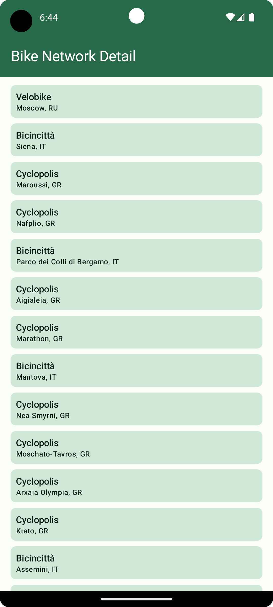
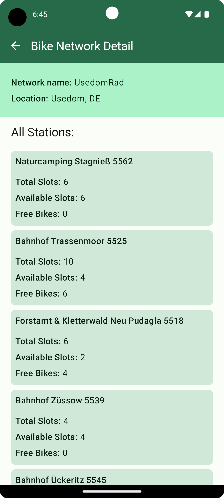

![JetComposeWithCleanArchitecture]

Jet Compose with Clean Architecture
===================================

This is the repository for the [Jet Compose with Clean Architecture] app. It is a **work in progress** 🚧.

**Jet Compose with Clean Architecture** is a fully functional sample Android app built entirely with Kotlin and Jetpack Compose. 
It follows implementation of Clean Architecture, MVVM, MVI, Jetpack Compose, Hilt, Retrofit, Repository pattern 
and best practices for the Android app design and development.

# Features

**Jet Compose with Clean Architecture** displays list of Bike Networks from https://api.citybik.es/v2/networks api.
This application has two screens:
**1. Bike Network List Screen**
Users can browse through the Bike Networks list. Each row displays the Name of the network and its location. 
User can click on the individual row to view the more information about the Bike Network.
**2. Bike Network Detail Screen**
On Bike Network Details screen user can see basic details of network like Name and location and a list of All 
stations available under this particular network. Multiple stations are displayed as a list of cards with following details-
- Station Name
- Total Slots
- Available Slots
- Free Bikes

## Screenshots

