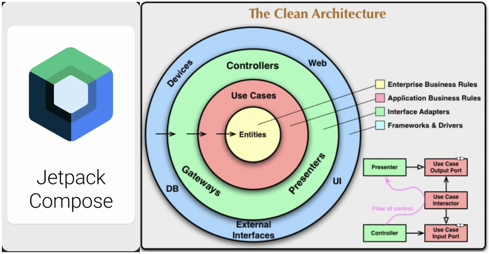
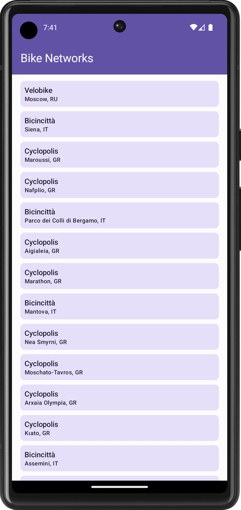
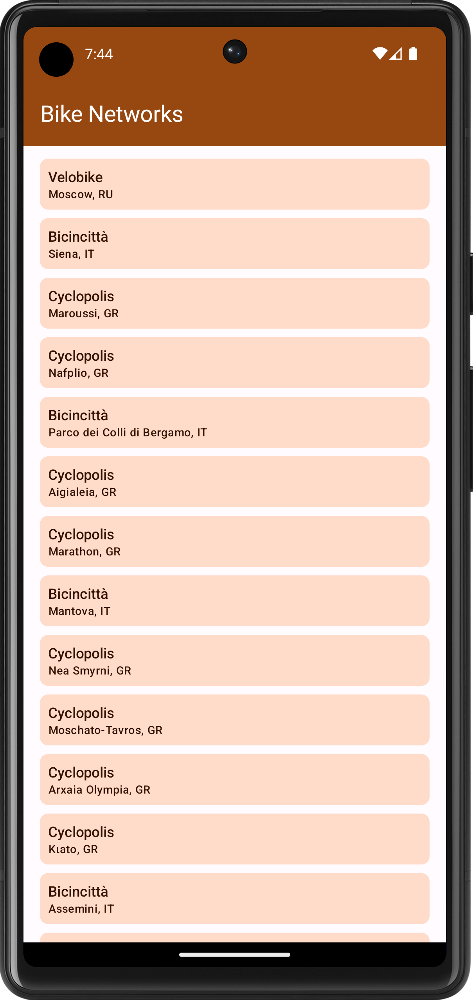
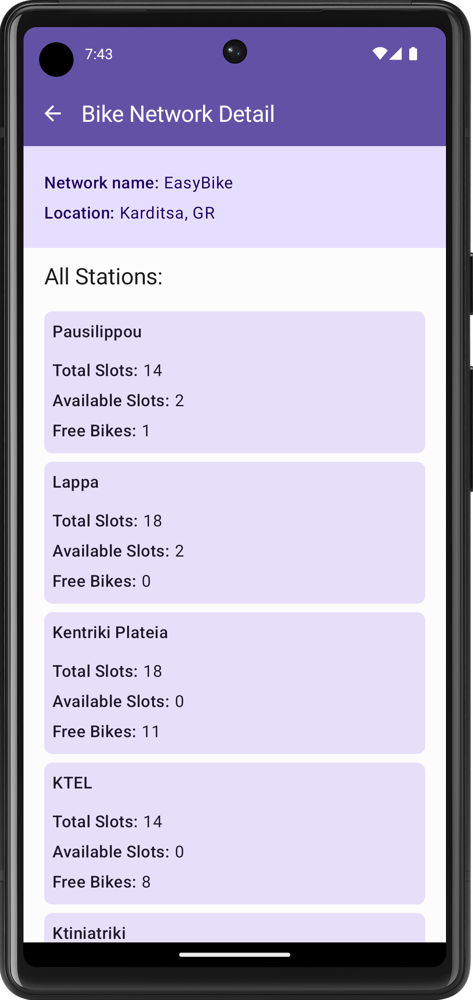
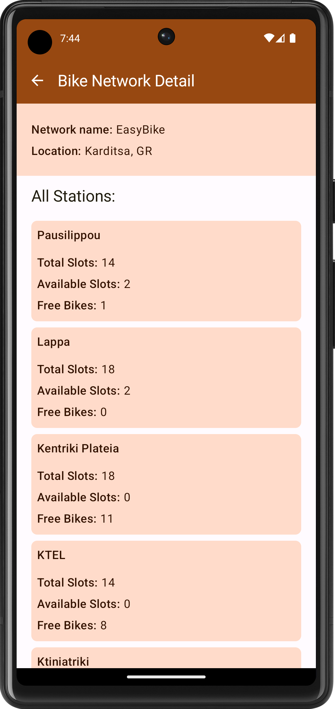
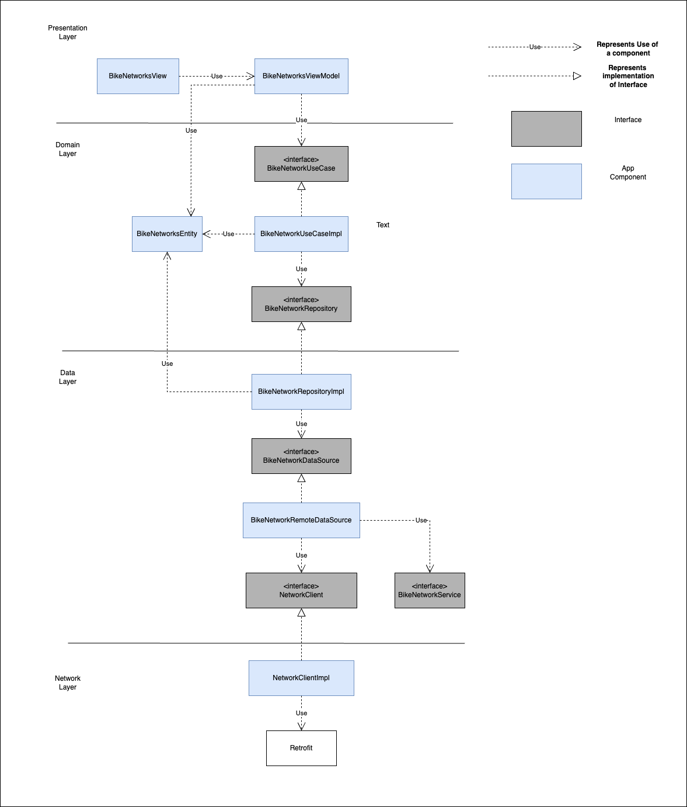
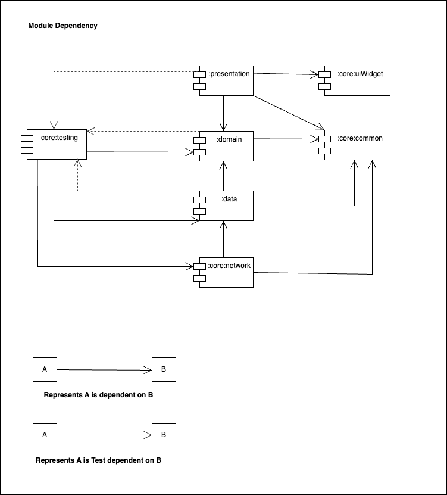

Jet Compose with Clean Architecture
===================================

This is the repository for the **Jet Compose with Clean Architecture** app.

**Jet Compose with Clean Architecture** is a fully functional sample Android app built entirely with Kotlin and Jetpack Compose. 
It follows implementation of Clean Architecture, MVVM, MVI, Jetpack Compose, Hilt, Retrofit, Repository pattern 
and best practices for the Android app design and development.

# Features

**Jet Compose with Clean Architecture** displays list of Bike Networks from https://api.citybik.es/v2/networks api.
This application has two screens:

**1. Bike Network List Screen**
Users can browse through the Bike Networks list. Each row displays the Name of the network and its location. 
User can click on the individual row to view the more information about the Bike Network.

**2. Bike Network Detail Screen**
On Bike Network Details screen user can see basic details of network like Name and location and a list of All 
stations available under this particular network. Multiple stations are displayed as a list of cards with following details-
- Station Name
- Total Slots
- Available Slots
- Free Bikes

## Screenshots
Following screenshots shows the behaviour of dynamic theme. When user changes the basic color in the **Wallpaper & style** then it is reflected in the app theme.

# Architecture

The **Jet Compose with Clean Architecture** app follows the Clean architecture along with MVVM,MVI and Repository pattern.
App architecture includes following modules which are implemented as Android Library and/or Kotlin Library
- **:app** : This is a Android app module which contains Application, Activity and Application theme related files and resources. 
- **:domain** : This is the business domain related module, It contains Business Entities and UseCase that operates with those entities.
- **:data** : This module contains the implementation of Repository, Datasource and the Model Mapper classes.
- **:presentation** : This module contains classes that are more related to the Android framework like JetPackCompose, ViewModel, Android resources, etc. This module contains the implementation of MVVM and MVI pattern.
- **:core:common** : This module contains the classes and code those should be shared across all the modules.
- **:core:network** : Network related classes like Dto, NetworkClient(Retrofit) and Services classes are defined in this module.
- **:core:uiWidgets** : This module is the JetCompose Widgets library which are reusable UI components across the app.
- **:core:testing** : This module contains the Unit Test cases and Android Test cases dependencies that can be shared between all the modules.

Below architecture diagram shows the dependencies and relationship between the key components of the architecture. We can clearly see that it is a layered architecture with **presentation**, **domain**, **data** and **network** layer.
Dependency between the layer is towards the center, Low level modules are dependent on the high level modules. So it is following the **Clean architecture.**

**Hilt** is used for the Dependency Injection. Using **Gradle** dependency between the modules is defined.

Below dependency diagram clearly shows that there is no cyclic dependency among the modules. **:testing** module is dependent on the **:core:domain** and **:core:network** module. Note that **:domain** module don't have the **dependency** on the **:testing** module, instead of that it is having **testDependency** which does not create cyclic dependency.

# Testing

To facilitate testing of components, **Jet Compose with Clean Architecture** uses dependency injection with
[Hilt](https://developer.android.com/training/dependency-injection/hilt-android).

Most data layer components are defined as interfaces.
Then, concrete implementations (with various dependencies) are bound to provide those interfaces to
other components in the app.
In tests, **Jet Compose with Clean Architecture** use [Mockk](https://mockk.io/ANDROID.html) library for mocking the components.